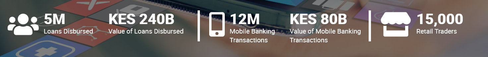

# Home Page View

	src/app/views/home/

### Header Component

	src/app/components/header

The icons under the Our Solutions dropdown menu are looped as shown in the code snippet below:

    <li
        *ngFor="let navItem of navigationItems"
        class="linkTab">

            <a
                routerLink="oursolutions/{{navItem?.slug}}"
                (click) ="scrollUpPage();"
            >

                <fa-icon
                    class="navIcon"
                    icon="{{navItem?.acf?.service_icon?.value}">
                </fa-icon>

                    {{navItem?.title?.rendered}}

            </a>

    </li>
                            
    
The icons and titles are retrieved from the WordPress dashboard, and data bound to the view.

    {{navItem?.acf?.service_icon?.value}}

    {{navItem?.title?.rendered}}

This is by traversing through the JSON object illustrated below:

    [
        {
            "title": {
                "rendered": "Customer and Product Management"
            },

            "acf": {
                "service_icon": {
                    "value": "users-cog",
                    "label": "User Cog"
                }
            }

        }   
    ]

    
This results to the dropdown menu below: 

### Banner Slider Component

    src/app/components/bannerslider

Owl Carousel has been used to create the slider for the icons. T

    createServicesCarousel(){
        $(".owl-carousel").owlCarousel({
            items:6,
            itemsDesktop : [1199,6],
            itemsDesktopSmall : [980,4],
            itemsTablet: [768,2],
            itemsTabletSmall: false,
            itemsMobile : [479,1],
            navigation : true,
            autoPlay: true,
            pagination: false,
            navigationText : ["",""],
            afterInit:this.equalizeCarouselItems,
        });
    }

The carousel is invoked on `ngAfterViewInit()` only when the input type is banner and the `sliderHighlights` input array has more than 1 slider item, in this case, the icons.

        if(this.type == "banner" && this.sliderHighlights.length > 0){

		    setTimeout(() => {

			    this.createServicesCarousel();

		    }, 100);

	    }

### Single solution component

	src/app/components/singlesolutionitem/

This component is made up of the **thumbnail image** of the solution, **a title**, **the excerpt** and **the call-to-action link**.

This single component has the following inputs: `{{image}}, {{title}}, {{description}}` and `{{link}}`

        <app-singlesolutionitem
        	*ngFor="let solution of ourSolutions"
            image="{{solution.acf.feature_image}}"
            title="{{solution.title.rendered}}"
            description="{{solution.acf.excerpt | slice : 0  : 100}} ..."
            link="oursolutions/{{solution.slug}}"

            class="one_quarter margin-bottom-3 singleItem"

        ></app-singlesolutionitem>

The data is gotten by traversing through the JSON object illustrated below:

    [
        {
        
            "title": {
                "rendered": "Customer and Product Management"
            },

            "link": "http://10.38.84.142/test-with-postgres/our_solutions/customer-and-product-management/",

            "acf": {
                "feature_image": "http://10.38.84.142/test-with-postgres/wp-content/uploads/2022/01/customer_management.jpg",
                "excerpt": "
Create a Single Customer and Business ID, capture and store individual and business KYC information from any channel. Create products and services, customer and business types, business rules, user access and authorization hierarchies, business branches, etc, to suit your business needs. Link customers and businesses to single or multiple services, to business branches, to products and services, and more.
\n",
            },

        },
    ]

Here's the illustration of a single solution:

All the solutions component get looped in the homepage as illustrated below:

### Statistics Section

If the statistics, have their respective icons, the `ngClass` directive adds the class `borderRight`, else, the white border doesn't appear.

     
    

### Footer Section

    src/app/components/footer/  

 
 Under Our Solutions, the links here are looped here and each has the event handler, `scrollUpSolutionsPage()` that scrolls to the top of the specific solutions page.

 In this case, it scrolls to the `bannerSection` class which is in all the single solution pages.

     scrollUpSolutionsPage(){
        $('html, body').stop().animate({
            scrollTop: $(".bannerSection").offset().top - 80
        }, 400);
    }
