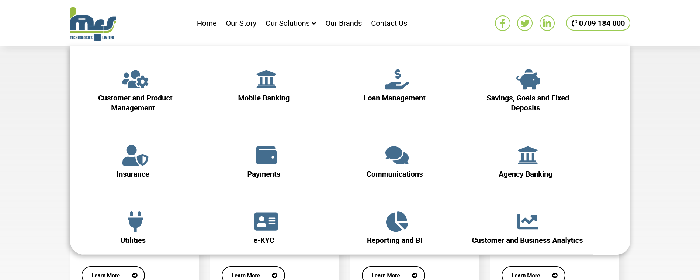
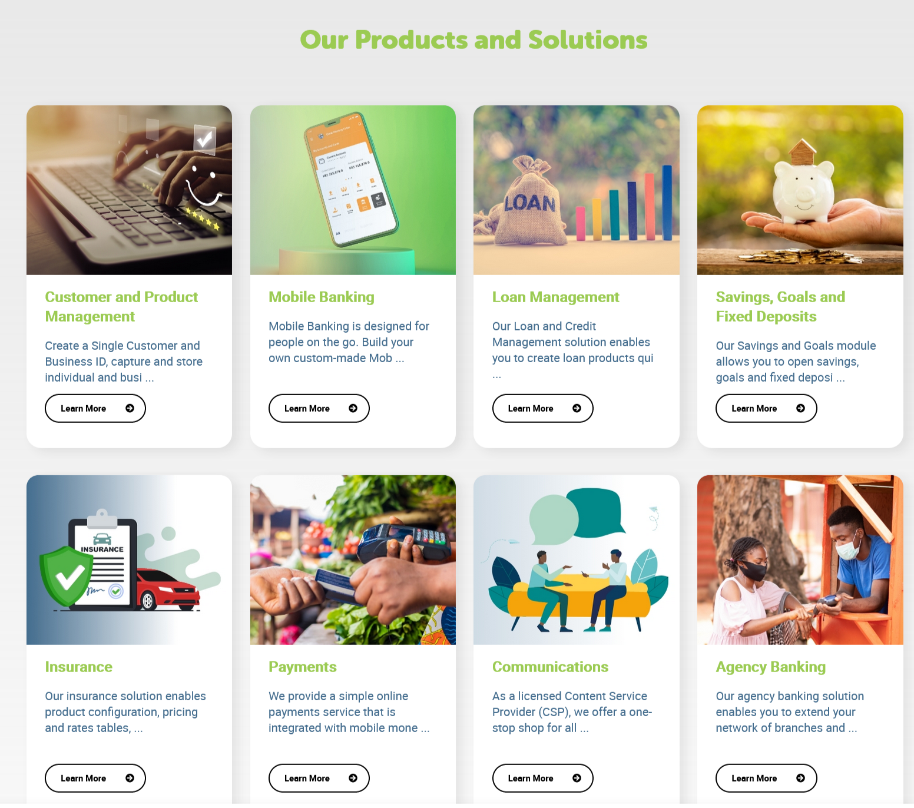
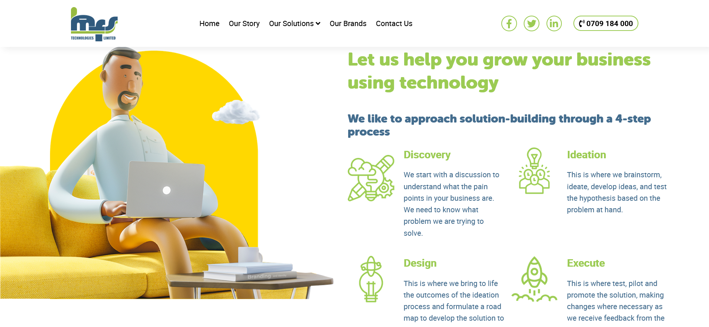
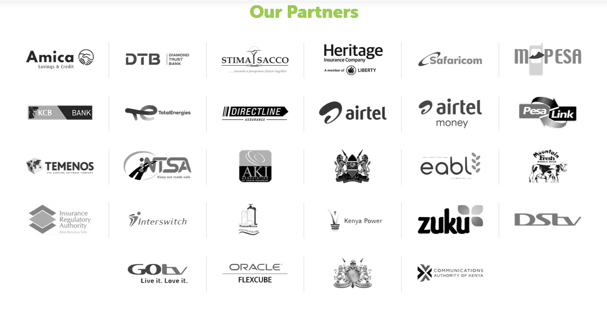

# Home Page View

The main home page component is found in the following directory.

	src/views/home/

### Header Component

### Banner Slider Component

This component contains the banner image and a slider of the solutions shown as icons

	components/bannerslider/

### Single solution component

This component is made up of the thumbnail image of the solution, a title, the excerpt and the call-to-action link.

This component can be found here:

	components/singlesolutionitem/

Here's the illustration of the component, with the following inputs: `{{image}}, {{title}}, {{description}} and {{link}}`

	 

            
        

        

            <h4 class="text-green">
                {{title}}
            </h4>

			

            

                    <a 
                        href="{{link}}"
                        class="blackOutlineBtn">
                        Learn More

                        <fa-icon
                            class="ctaIcon"
                            [icon]="['fas', 'arrow-circle-right']">
                        </fa-icon>

                    </a>
            

        

Here's the illustration of a single solution:

All the solutions component get looped in the homepage as illustrated below:

Through a for loop and fetching data from the Advanced Custom Field API, the content gets to be displayed, as shown below:

        <app-singlesolutionitem
        	*ngFor="let solution of ourSolutions"
            image="{{solution.acf.feature_image}}"
            title="{{solution.title.rendered}}"
            description="{{solution.acf.excerpt | slice : 0  : 100}} ..."
            link="oursolutions/{{solution.slug}}"

            class="one_quarter margin-bottom-3 singleItem"

        ></app-singlesolutionitem>

### Statistics Section

### Content Section

### Partners Section

### Footer Section

