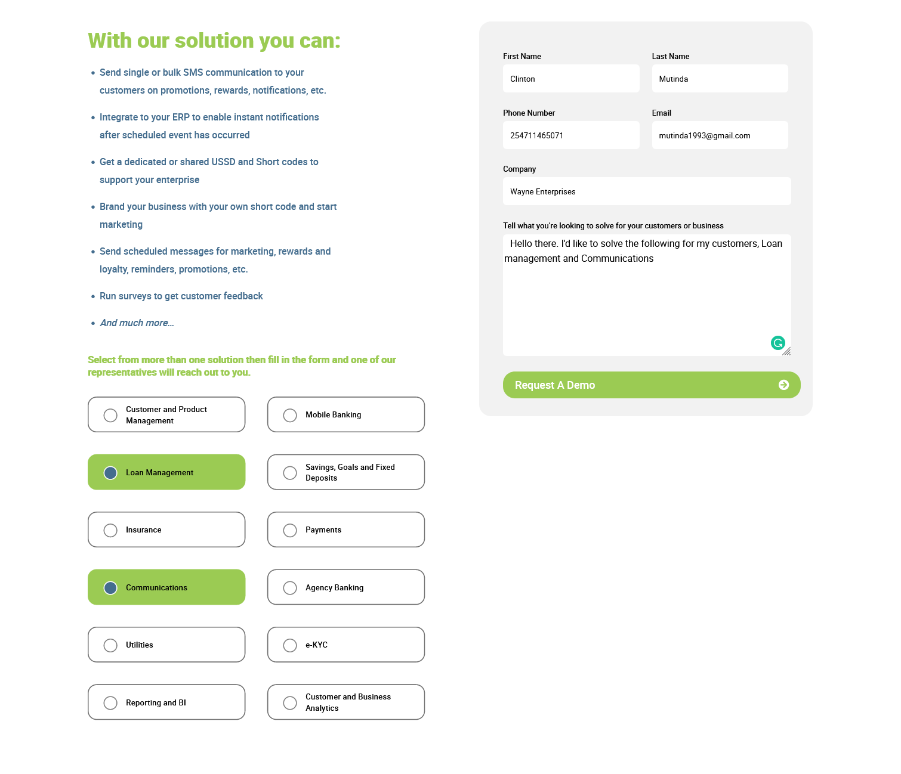

# Single Solution View

	src/views/singlesolution/

### Solutions Banner Component

	src/app/components/solutionsbanner

This component is made up of the **title** of the solution, **a title**, **the excerpt** and **the banner image**.

This single component has the following inputs: `{{image}}, {{title}}` and `{{excerpt}}`

	<app-solutionsbanner
		title="{{pageDetails?.title?.rendered}}"
		excerpt="{{pageDetails?.acf?.excerpt}}"
		*ngIf="!loadingView"
		image="{{pageDetails?.acf?.banner_image}}"
	></app-solutionsbanner>

The data is gotten by traversing through the JSON object illustrated below:

    [
        {
        
            "title": {
                "rendered": "Insurance"
            },

        "acf": {
            "banner_image": "http://10.38.84.142/test-with-postgres/wp-content/uploads/2022/01/insurance.jpg",
            "excerpt": "
Our insurance solution enables product configuration, pricing and rates tables, customer registration, vehicle and individual/company e-KYC, product selection and endorsements, payments, SMS communications and reminders, insurance premium financing, policy renewals and cancellations, claims submission, processing and tracking, all in one package.
\n",
        },

        },
    ]

Here's the illustration of the single solution banner component:

### Solutions Form

This is made up of two sections:
- The clickable labels
- The contact form

#### Clickable Labels

These labels are looped here:

			<label
				class="singleSolution d-flex"
				[ngClass]="solutionSlug == service?.slug ? 'activeSolution' : ''"
				for="{{service?.slug}}"
				[attr.data-value]="service?.slug"
				(click)="selectSolution($event);"
				*ngFor="let service of serviceOfInterest" >

				<input
					type="checkbox"
					[checked]="solutionSlug == service?.slug ? 'activeSolution' : ''"
					name="{{service?.slug}}"
					[attr.data-value]="service?.title?.rendered"
					id="{{service?.slug}}">

				

					{{service?.title?.rendered}}

			</label>

#### Contact Form

On submitting the details, the `onSubmit()` event handler is called. This event handler has an observable `submitContactDetails` that posts the details to its respective endpoint.

This service can be accessed here:
	
	src/app/services/content-management.service/  

Here's the method that posts the submitted details:

  	submitContactDetails(formData){

      return this.http.post(`${environment.contactEndPoint}`,formData);

  	}

